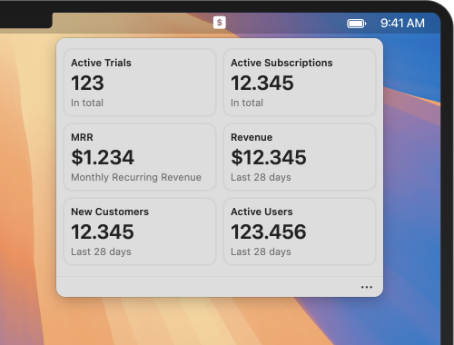

# Revenue Bar

Revenue Bar lets you track your revenue from the RevenueCat right in the menu bar.

Authorize with a secure, limited scope, read-only secret key that can be generated only for this app. No sign-in with your full credentials is needed!

Add as many projects as you need.

Enable open at login to have it ready at each system restart.

The app from the Mac App Store allows you to add one project for free, and you can buy the full version at a single lifetime purchase of $5.99.
You are also welcome to download the code, build the project for yourself, and use it for free.

_This is not an official RevenueCat application._
